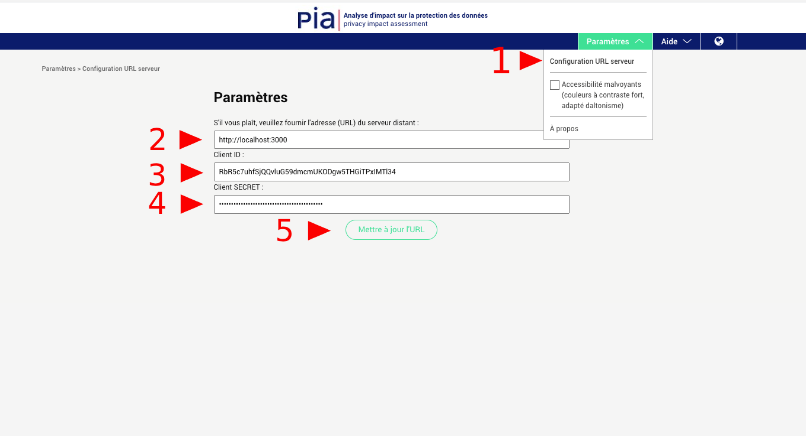

# Le logiciel PIA / The PIA Software
 Le logiciel PIA est un outil distribué librement par la [CNIL](https://www.cnil.fr/fr/outil-pia-telechargez-et-installez-le-logiciel-de-la-cnil) afin de faciliter la réalisation d’analyses d’impact sur la protection des données prévues par le RGPD.
PIA-BACK est développé avec le framework RubyOnRails mettant à disposition une API RESTful à destination des outils PIA et PIA-APP.

The PIA software is a free tool published by the [CNIL](https://www.cnil.fr/en/open-source-pia-software-helps-carry-out-data-protection-impact-assesment) which aims to help data controllers build and demonstrate compliance to the GDPR. 
PIA-BACK is developped with RubyOnRails providing a RESTful API for the PIA and PIA-APP applications. 

## Installation
You can follow <a href="https://github.com/LINCnil/pia/issues/77" target="_blank">this runbook</a> for a full installation of pia (back-end) and pia (front-end) applications on a ubuntu 17.10 server.

### Requirements
- [pia (front-end) application](https://github.com/LINCnil/pia) and/or [pia (stand-alone) application](https://github.com/LINCnil/pia-app)
- [Ruby](http://www.ruby-lang.org) 2.6.5
- [Rails](http://rubyonrails.org) 6.0.2
- [PostgreSQL](https://www.postgresql.org) 12.0+

### System requirements
- CPU : i5
- Ram: 4Go
- Disk Space : 20Go 
- OS : preferably Linux but other OS works as well

### PostgreSQL installation
Basic installation on Debian you can use the following documentation: [wiki.debian.org/PostgreSql](https://wiki.debian.org/PostgreSql)
on Ubuntu you can use: [help.ubuntu.com/community/PostgreSQL](https://help.ubuntu.com/community/PostgreSQL)

Also, you need to create a new user with password.

### Clone the repository
`git clone https://github.com/LINCnil/pia-back.git`

### Go to the folder pia-back
`cd pia-back`

### Create and fill the file database.yml
`cp config/database.example.yml config/database.yml`

Fill the fields `username` and `password` for each environment with the PostgreSQL username and password created in the step "PostgreSQL installation".

### Install all dependencies
`bundle install`

### Create and fill the file application.yml
`cp config/application.example.yml config/application.yml`

Generate the SECRET_KEY_BASE with: `bin/rake secret` and paste the secret key in the file.

### Create database
`bin/rake db:create`

### Create tables
`bin/rake db:migrate`

### Run the application
- `bin/rails s` your server will be accessible with the URL `localhost:3000`

- You can specify the option `-b` to bind to a public IP address or domain name and `-p` to use a different port.

    For example: `bin/rails s -b 123.456.789.101 -p 8080` your server will be accessible with the URL `123.456.789.101:8080`

- Then, in [the pia (front-end) application](https://github.com/LINCnil/pia), use this URL to enable the server mode. 

- Fill the field in "Tools" > "Settings"

### Run the application in production mode
1. Fill the `production` section in the `database.yml`file.
2. Create the database: `RAILS_ENV=production bin/rake db:create`
3. Create the tables: `RAILS_ENV=production bin/rake db:migrate`
4. Run the server: `RAILS_ENV=production bin/rails s`

### How to update to the latest version

Go to the folder pia-back : `cd pia-back`

Update the repository : `git pull`

Update the dependencies : `bundle install`

Update the database : `RAILS_ENV=production bin/rake db:migrate`

### Run the test
`bin/rake`

## Contributions
- [Docker set-up](https://github.com/kosmas58/pia-docker) ([Kosmas Schütz](https://github.com/kosmas58)): a Docker-Compose configuration for production purpose. Everything is automated from creating containers to setting up the database. 
- [Installation runbook](https://github.com/LINCnil/pia/issues/77) ([ylachgar](https://github.com/ylachgar)): runbook to install the pia tool server version on a ubuntu 17.10 server.

